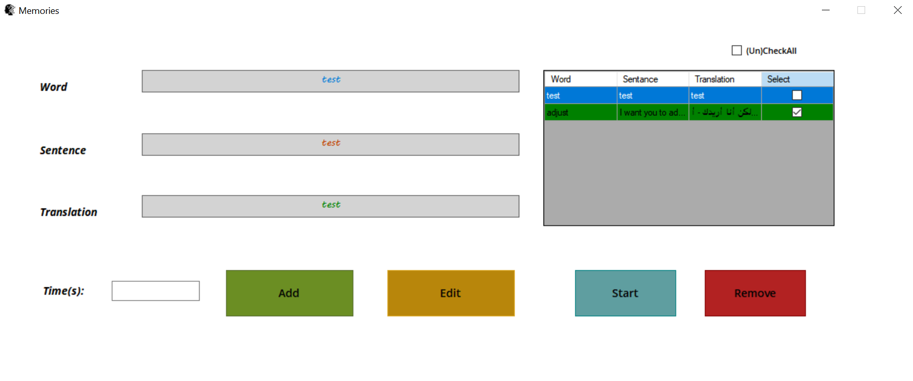
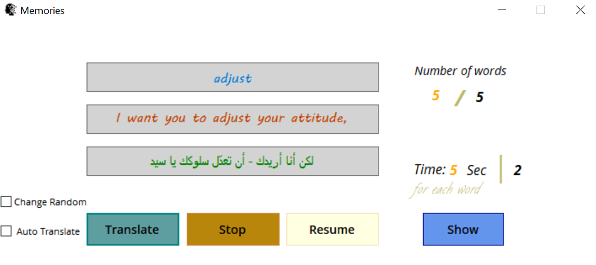

# Memories ⚡ 
> 📝✍👍👌

 App can help you remember and memorize speech and terminology through repetition at separate intervals of time.

## DO:

- Add new word and prevent repetition
- Set time for each word
- Repetition Static or Random
- Modify/Delete words from DataTable

## Design

 

## License
Memories App is licensed under the GNU General Public License v3.0. See the [LICENSE](https://github.com/hsayed21/Memories/blob/master/LICENSE)
file for more information.
