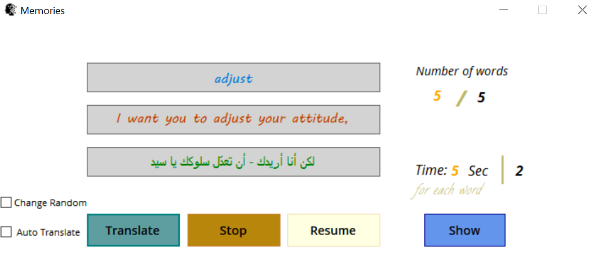

# Memories ⚡ 
> 📝✍👍👌

 App can help you remember and memorize speech and terminology through repetition at separate intervals of time.

## DO:

- Add new word and prevent repetition
- Set time for each word
- Repetition Static or Random
- Modify/Delete words from DataTable

## Design

 

